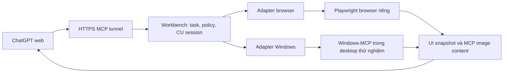

# Computer use qua MCP cho ChatGPT web

Ngày nghiên cứu: 2026-09-26. Mã nguồn local: `4c09b02d87e63a765b7a9b3bbb0c28e7a1b750df`.

## Kết luận và mức độ xác minh

Có cơ sở kỹ thuật để ChatGPT web điều khiển browser hoặc Windows thông qua MCP riêng: ChatGPT gọi tool; backend trên máy thực thi; backend trả trạng thái UI và ảnh; ChatGPT quyết định bước tiếp theo. OpenAI xác nhận Developer mode trên web hỗ trợ MCP tools đọc/ghi. Tài liệu computer use cũng cho phép dùng UI tools tự định nghĩa qua function calling hoặc remote MCP.

Đây là kết luận về khả năng tích hợp, chưa phải chứng nhận chạy end-to-end với connector/tài khoản của người dùng. Thêm MCP không tự bật native `computer` tool của Responses API hay plugin Computer Use của ứng dụng desktop. Với kiến trúc MCP trực tiếp, backend chỉ thực thi thao tác nên không cần gọi một model API thứ hai. Nếu backend tự chạy agent bằng Responses API thì đó là một phương án khác, có cấu hình API và vòng lặp riêng.

Trong lần nghiên cứu này, `workbench()` và `task_handoff(read)` qua Coder đều trả `UNAVAILABLE`, tunnel probe HTTP 404. Đã đọc source local và chạy probe proxy trong bộ nhớ; chưa cài backend CU, chưa điều khiển desktop, chưa đổi policy/config, chưa thử trên ChatGPT web. Không cập nhật được handoff qua connector.

## Phương án chốt theo nhu cầu Facebook và Colab

Chốt kiến trúc kết hợp: Playwright điều khiển browser là đường chính; Windows-MCP xử lý UI desktop/native dialog khi browser backend không xử lý được. Workbench quản lý session, policy, job state và xác minh kết quả. Bản nghiên cứu ghi nhận quyết định trước triển khai; tiến độ hiện tại ở [kế hoạch](computer-use-implementation-plan.md) và [báo cáo kiểm thử](computer-use-verification.md).

Browser dùng Chrome/Edge với profile chuyên dụng giữ đăng nhập Facebook/Google. Khi cần thao tác đúng browser đang mở, dùng kết nối extension sau khi thiết lập và kiểm thử. Ưu tiên upload qua file input/file chooser của browser bằng đường dẫn file đã được cấp quyền; dùng Windows dialog khi cần. File local và file trong Drive/runtime Colab phải được phân biệt, không tự coi đường dẫn Windows là đường dẫn Colab.

### Luồng Facebook

1. Mở browser, vào đúng tài khoản và đích đăng do người dùng chỉ định; với Page, ưu tiên giao diện Meta Business Suite khi có chức năng phù hợp.
2. Chọn đúng ảnh/video từ đường dẫn được chỉ định; đợi upload/xử lý hoàn tất, kiểm tra đúng file trong preview.
3. Nhập mô tả và thông tin bài theo yêu cầu. Chọn ngày, giờ và múi giờ cụ thể nếu lên lịch.
4. Đăng/lên lịch trong phạm vi yêu cầu được cấp; kiểm tra bài đã tồn tại trong danh sách Published/Scheduled đúng nội dung và thời gian. Không kết luận thành công chỉ từ lần bấm nút.
5. Nếu timeout sau submit, kiểm tra danh sách trước khi retry để tránh đăng trùng. Nếu đích đăng không có chức năng lên lịch, báo không hỗ trợ tại đích đó; không tự giả lập scheduler đăng công khai.

### Luồng Google Colab

1. Mở đúng notebook URL/tool do người dùng chỉ định, kiểm tra tên notebook và cell/form cần chạy; không tự đổi sang notebook khác.
2. Điền tham số/text, chọn chế độ và kết nối runtime theo yêu cầu, chạy đúng cell hoặc Run all nếu được chỉ định.
3. Trong quá trình chạy, phát hiện form/input yêu cầu text, file hoặc lựa chọn; dùng thông tin và file người dùng đã cung cấp. Thiếu dữ liệu bắt buộc thì chuyển job sang `waiting_input`, lưu vị trí cần tiếp tục.
4. Theo dõi trạng thái từng cell/run cùng output: phân biệt `running`, `waiting_input`, `succeeded`, `failed`, `disconnected`, `cancelled`. Runtime connected hay cell hết quay không đủ chứng minh thành công.
5. Tiêu chí hoàn tất gắn với notebook cụ thể: các cell mục tiêu hoàn tất không lỗi, output thành công và file/link đầu ra mong đợi nếu notebook tạo artifact. Ghi lại tên/path/link artifact thực tế; nếu chưa xác minh được thì trả trạng thái chưa xác định.

### Job dài và giới hạn vòng lặp

Thêm job manager local lưu `job_id`, task/session, URL/tab, bước hiện tại, observation cuối, input còn thiếu và output. Poll trạng thái có timeout/backoff, không giữ một MCP request suốt toàn bộ job. Đóng chat không đồng nghĩa backend tự có model để quyết định bước mới: MCP thuần không tự đánh thức ChatGPT. Có thể lưu/theo dõi trạng thái bằng worker đã lập trình và tiếp tục khi chat gọi lại; muốn xử lý linh hoạt hoàn toàn khi chat đóng cần cơ chế agent/scheduler riêng, ngoài phương án MCP trực tiếp này.

### Tiêu chí nghiệm thu hai workflow

- Facebook: một bài ảnh và một bài video có mô tả tiếng Việt, đúng đích đăng và thời gian; kiểm tra được trong Scheduled/Published, không trùng bài sau retry.
- Colab: notebook thử nghiệm có nhập text và upload file trong lúc chạy; agent xử lý được cả hai, nhận ra lỗi chủ động và lần chạy thành công, xác minh artifact cuối.
- Native file dialog, file picker của web/Drive, tiếng Việt, upload lớn, reconnect và chờ xử lý đều có case riêng.
- Hai workflow dùng cùng cơ chế ownership; đăng nhập/2FA/CAPTCHA hoặc cấp quyền tài khoản cần người dùng xử lý khi xuất hiện, không thiết kế cơ chế vượt chúng.

## Chi tiết các vấn đề trong repository

| Vị trí | Phát hiện | Tác động tới CU |
| --- | --- | --- |
| `src/lib/mcp-upstream-manager.ts` | Có transport stdio/HTTP, connection dùng chung theo `serverId` | Tái sử dụng được kết nối; cần bổ sung tách phiên hoặc lease cho UI state |
| `src/lib/tool-profile.ts` | Default `slim` có `mcp_servers`, thiếu `mcp_tools`, `mcp_call`, tool proxy | Chỉ thêm upstream config chưa đủ để ChatGPT phát hiện tool |
| `src/lib/tool-result.ts` | Helper trả top-level `content` chỉ có text | Không dùng nguyên helper này để chuyển ảnh |
| `src/tools/mcp-bridge.ts` | `mcp_call` đặt upstream content trong JSON payload | Ảnh base64 nằm trong JSON không tương đương MCP image content |
| `src/lib/mcp-tool-proxy.ts` | `formatUpstreamResult()` nối content bằng chuỗi hoặc chỉ lấy structuredContent | Mất ảnh; nếu không có structuredContent, image object thành `[object Object]` |
| `src/lib/mcp-tool-proxy.ts` | Không chuyển tiếp `isError`; wrapper mặc định thành công | Backend lỗi nhưng model có thể nhận `ok: true` |
| `src/lib/mcp-tool-proxy.ts` | Chuyển schema đơn giản, không giữ đầy đủ enum/union/nested constraints; mọi proxy có annotation edit | Nên dùng adapter với schema rõ ràng và phân loại quyền do Workbench quản lý |
| `src/lib/workbench.ts` | Chặn `mcp_call` ở workspace-only; unknown proxy có thể bị chặn là unclassified; phân loại upstream dựa một phần vào prefix | Phải khai báo CU là thao tác ngoài workspace, không dựa vào tên prefix để suy ra quyền |
| `src/lib/workbench.ts` | Khóa operation chủ yếu theo execution root | Không bảo vệ một desktop dùng chung giữa nhiều task/worktree |

`expose: allowlist` hiện là bộ lọc đăng ký proxy, không phải ranh giới phân quyền toàn bộ upstream: `mcp_call`/`manager.callTool()` không kiểm tra danh sách đó. Khi thêm CU, phải kiểm tra allowlist tại điểm thực thi hoặc giới hạn ngay tool set của backend.

### Probe đã chạy

Dùng source TypeScript qua runtime `tsx` đã có trong repo, fake server và fake upstream manager; không khởi động MCP server hay thay đổi desktop:

```text
image_forwarding: topLevelTypes=["text"], value="Screen ready\n[object Object]"
upstream_error: isError=null, ok=true
slim_discovery: mcp_call=false, proxy=false
```

Probe dùng image payload giả để kiểm tra hình dạng kết quả, không kiểm tra giải mã ảnh. Test integration hiện có kiểm tra list/call/proxy bằng phép cộng; chưa chứng minh ảnh, UI state hay ChatGPT web. Chưa chạy lại toàn bộ test suite vì chưa sửa implementation.

## Lựa chọn backend

### Playwright MCP cho web

- Đã đọc README và package tại commit `e87bb897e15a6f2af402afb0f10b45eced9e1f9b`; package khai báo `0.0.82`, Apache-2.0, Node >=18, phụ thuộc Playwright/Playwright Core bản alpha cụ thể trong package.
- Dùng accessibility snapshot để thao tác với phần tử; ảnh hỗ trợ kiểm tra giao diện. Có browser profile riêng, chế độ isolated và extension để nối browser hiện có.
- Phù hợp kiểm thử website, điền form, dashboard. Không điều khiển mọi ứng dụng Windows.
- Phải pin package và dependency thực tế khi triển khai; commit đã đọc không đồng nghĩa bản npm tương ứng đã được kiểm thử tại máy này.
- Cài package sẽ tạo dependency/cache của npm; browser runtime và profile/output cần vị trí cấu hình rõ. Đề xuất dependency riêng cho CU và thư mục profile theo task; không tự ghi config Chrome đang dùng. `--isolated` là tách browser state, không phải sandbox bảo mật OS.

### Windows-MCP cho desktop

- Đã đọc source tại commit `97979d6f6ff987f591ccfad8d2c15b9103db1091`; package khai báo `0.8.6`, MIT, Python >=3.14, target Windows 10/11 trong metadata. README quảng cáo OS cũ rộng hơn; chưa xác minh các OS đó.
- Source có `Snapshot`, `Screenshot`, `Click`, `Type`, `Scroll` và các tool khác. Snapshot kết hợp cây UI và ảnh tùy chọn; Screenshot có thể resize ảnh nên phải xử lý hệ tọa độ.
- Dependencies gồm FastMCP, pywin32/comtypes, dxcam/Pillow, PostHog. Có test screenshot/UI nhưng chưa chạy chúng trên máy này.
- Dùng một venv riêng và executable cố định, không cần cài global. File thay đổi dự kiến: môi trường Python riêng, lock/config backend và cấu hình adapter Workbench. Chưa chạy installer hay thay đổi startup/service.
- Telemetry mặc định bật theo SECURITY.md; cấu hình thử nghiệm đề xuất `ANONYMIZED_TELEMETRY=false`. Ảnh được trả cho ChatGPT sẽ đi qua connector tới dịch vụ; xử lý screenshot tại máy không có nghĩa ảnh chỉ ở local.
- Backend cung cấp cả Shell và công cụ hệ thống khác; chỉ bật nhóm UI cần thiết và chặn đường gọi raw ngoài allowlist.

### Tự viết adapter Windows hẹp

Workbench tự định nghĩa `computer_observe`, `computer_act`, `computer_session`; backend có thể bọc Windows-MCP hoặc thư viện Windows UI Automation. Ưu điểm là schema, quyền và session rõ; chi phí là phải xử lý focus, DPI, nhiều màn hình, UIA không đầy đủ và lỗi ứng dụng. Đề xuất tái sử dụng backend, tự viết lớp adapter nhỏ trước khi cân nhắc tự xây engine.

## Kiến trúc đề xuất



Đây là thiết kế đề xuất, chưa có trong code:

1. **Observation:** trả text/UI tree ngắn, image content đúng chuẩn, `observation_id`, window/tab identity, kích thước ảnh, scale và monitor offset. Không nhét base64 vào text log/structured summary.
2. **Action:** các thao tác có schema hữu hạn như click/type/scroll/key; mỗi nhóm thao tác ngắn kèm observation mới. Kiểm tra observation còn hợp lệ và focus/window trước khi thực thi. Timeout không có nghĩa action chưa xảy ra: đọc trạng thái trước khi retry, tránh click/submit hai lần.
3. **Session:** server gắn session với task/conversation đã xác thực. Browser cần context/process riêng theo task. Desktop dùng lease một controller tại một thời điểm trên cùng desktop, có TTL và nút dừng ở dashboard; worktree riêng không tạo desktop riêng.
4. **Permissions:** browser/desktop có external effects, không được coi là an toàn chỉ vì `cwd` thuộc workspace. Tuân thủ Ask/Auto/Full hiện hành, không tự bật Full. Snapshot cũng phải nằm trong phạm vi app/window được cấp. Không tin annotation của upstream để tự cấp quyền.
5. **Review:** ghi hành động và kết quả ngắn, có giới hạn lưu ảnh. Undo file của Workbench không hoàn tác thao tác GUI. Nội dung web/ảnh là dữ liệu quan sát, không phải nguồn chỉ thị được cấp quyền.

## Lộ trình nhỏ, có thể tháo bỏ

1. Sửa chuyển tiếp multimodal và lỗi ở bridge/proxy; thêm test fake upstream text + image + structuredContent + isError. Đây là cải tiến dùng chung, có thể giữ độc lập với CU.
2. Thử connector ChatGPT web bằng tool trả ảnh kiểm thử có mã ngẫu nhiên chỉ xuất hiện trong pixels. Model phải đọc đúng mã; hiển thị ảnh cho người dùng chưa đủ chứng minh model nhìn được ảnh. Nếu không đạt, ưu tiên UI tree và tiếp tục tìm nguyên nhân đường ảnh.
3. Thêm adapter Playwright tùy chọn, disabled mặc định, tool surface gọn trong profile phù hợp. Test một form local không gửi dữ liệu ra ngoài. Có thể tắt adapter mà không đổi công cụ file/Git.
4. Thêm adapter Windows tùy chọn trong desktop/VM thử nghiệm; test Calculator và Notepad. Mở rộng sau khi lease, quyền và stop hoạt động. Có thể ngắt backend và gỡ môi trường Python riêng.

## Acceptance test trước khi kết luận “dùng được”

- ChatGPT web discover được tool sau refresh, gọi và đọc UI tree được.
- Ảnh native đi qua tunnel/proxy, model đọc đúng mã chỉ có trong ảnh.
- Browser hoàn thành form local và xác minh trạng thái cuối; Windows nhập/đọc lại Unicode tiếng Việt và tính phép toán trong Calculator.
- Tọa độ đúng ở DPI 100%/150%, screenshot resize và nhiều màn hình; window/focus thay đổi phải được phát hiện trước hành động.
- Hai chat/task không dùng nhầm UI state hoặc điều khiển đồng thời một desktop.
- Ask, Auto, Full, workspace-only, WRITER_REQUIRED và thu hồi lease đều được kiểm tra; pending approval không bị gửi lại.
- Backend lỗi giữ `isError`; timeout/reconnect không tự lặp hành động đã có side effect. Nút dừng thu hồi quyền thao tác tiếp.
- Đo số tool calls, thời gian mỗi action/observation và tỷ lệ hoàn thành bằng lần chạy thực; chưa có số đo để cam kết độ nhanh/ổn định.

## Nguồn

### Đợt tối ưu sau thử nghiệm click (27/09/2026)

Người dùng báo ChatGPT web mất hơn 4 phút để làm 12/20 click và gặp client safety checks; trang có quảng cáo còn gặp `COMPUTER_UI_CHANGED`. Đã đọc source thực sự cài từ `@playwright/mcp@0.0.82` → `playwright-core@1.64.0-alpha-1789764292000`, tại bundle `lib/coreBundle.js` (các nguồn gốc `tools/backend/response.ts`, `tools/backend/utils.ts`, `tools/mcp/program.ts`, browser factory), cùng Windows-MCP 0.8.6 `tools/input.py`/`snapshot.py`.

- Playwright đã dùng `launchPersistentContext(userDataDir)`; adapter truyền thư mục hash theo task. Vấn đề là thiếu luồng setup và thông tin profile, không có bằng chứng launcher đang dùng `--isolated`. Đã xác minh cookie/localStorage qua đóng/mở lại thay vì suy từ hình dáng cửa sổ mới.
- Backend action snapshot mặc định xuất file YAML; gọi `browser_snapshot` lần nữa làm tăng lượt. Adapter đọc đúng file tự sinh trong output của task, kiểm tra canonical path, tên, regular file/hardlink và kích thước; trả snapshot + observation ID ngay trong kết quả action. Không lấy path tùy ý từ model.
- Kiểm tra digest toàn trang gây từ chối vì nội dung không liên quan thay đổi. Click/type/select chuyển sang xác minh target và URL/tab/modal; vẫn giữ auto-wait/hit target của Playwright, không force-click. Nhóm click có giới hạn, đối chiếu mỗi bước và báo phần đã làm/lần chưa rõ.
- Playwright có settle mặc định 500 ms sau input và thêm lần chờ khi có network. Adapter dùng option chính thức 100 ms; việc hoàn tất workflow vẫn dựa evidence. Windows input dùng label đã capture; chưa đủ test native để bỏ kiểm tra focus/digest hoặc thêm batch desktop.

Quyết định: tối ưu lớp adapter và cấu hình chính thức trước, giữ dependency pin. Không sửa trực tiếp `node_modules` hay Python site-packages, không fork toàn engine khi chưa cần. Playwright MCP có Apache-2.0, Windows-MCP có MIT theo metadata; nếu vendor/fork sau này phải giữ notices/license tương ứng. Lỗi client safety checks không được giải quyết bằng đổi annotation hoặc gọi tool thay thế.


- [OpenAI: ChatGPT Developer mode](https://developers.openai.com/api/docs/guides/developer-mode)
- [OpenAI: Computer use và UI tools riêng](https://developers.openai.com/api/docs/guides/tools-computer-use)
- [OpenAI: Computer Use trong ứng dụng desktop](https://learn.chatgpt.com/docs/computer-use)
- [MCP 2025-06-18: tool result và image content](https://modelcontextprotocol.io/specification/2025-06-18/server/tools)
- [Playwright MCP README đã pin](https://github.com/microsoft/playwright-mcp/blob/e87bb897e15a6f2af402afb0f10b45eced9e1f9b/README.md)
- [Playwright MCP package đã pin](https://github.com/microsoft/playwright-mcp/blob/e87bb897e15a6f2af402afb0f10b45eced9e1f9b/package.json)
- [Windows-MCP package đã pin](https://github.com/CursorTouch/Windows-MCP/blob/97979d6f6ff987f591ccfad8d2c15b9103db1091/pyproject.toml)
- [Windows-MCP Snapshot/Screenshot implementation](https://github.com/CursorTouch/Windows-MCP/blob/97979d6f6ff987f591ccfad8d2c15b9103db1091/src/windows_mcp/tools/snapshot.py)
- [Windows-MCP input implementation](https://github.com/CursorTouch/Windows-MCP/blob/97979d6f6ff987f591ccfad8d2c15b9103db1091/src/windows_mcp/tools/input.py)
- [Windows-MCP SECURITY.md](https://github.com/CursorTouch/Windows-MCP/blob/97979d6f6ff987f591ccfad8d2c15b9103db1091/SECURITY.md)
